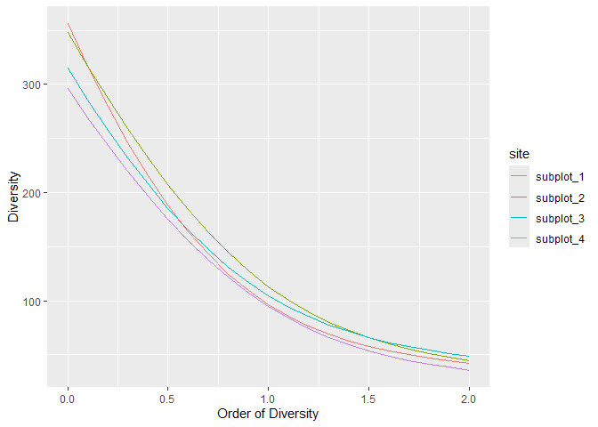

<!-- README.md is generated from README.Rmd. Please edit that file -->

# Diversity measures based on Entropy

<!-- badges: start -->


[](https://app.codecov.io/github/EricMarcon/divent)
[](https://www.codefactor.io/repository/github/ericmarcon/divent/overview/master)
[](https://CRAN.r-project.org/package=divent)
[](https://CRAN.R-project.org/package=divent)
[](https://CRAN.R-project.org/package=divent)
<!-- badges: end -->

**divent** is an R package that provides functions to estimate alpha,
beta and gamma diversity of communities, including phylogenetic and
functional diversity.

It is a reboot of the package **entropart** to make it tidy, easier to
use and optimize the code that has been added along years of research.

## Installation

You can install the development version of divent from
[GitHub](https://github.com/) with:

``` r
# install.packages("pak")
pak::pak("EricMarcon/divent")
```

## Details

In the divent package, individuals of different *species* are counted in
several *communities* which may (or not) be aggregated to define a
*metacommunity*. In the metacommunity, the probability to find a species
in the weighted average of probabilities in communities. This is a
naming convention, which may correspond to plots in a forest inventory
or any data organized the same way.

``` r
# Abundances of three communities with four species
abd <- matrix(
  c(
    10,  0, 25, 10, 
    20, 15, 10, 35, 
     0, 10,  5,  2
  ),
  ncol = 4
)
# Community weights
w <- c(1, 2, 1)

# Organize the data
library("divent")
abd |>
  as_abundances(weights = w) |>
  # Plot it
  plot(type = "Metacommunity")
```


Basic functions allow computing diversity of a community. Example data
is a 6.25ha plot of rainforest in Paracou, French Guiana, divided into 4
subplots.

``` r
paracou_6_abd |>
  autoplot()
```


Entropies such as Shannon’s, Simpson’s, or Hurlbert’s, and explicit
diversity (i.e. effective number of species), aka Hill numbers, are
estimated.

``` r
# Diversity of a tropical rainforest
div_richness(paracou_6_abd)
#> # A tibble: 4 × 5
#>   site      weight estimator   order diversity
#>   <chr>      <dbl> <chr>       <dbl>     <dbl>
#> 1 subplot_1   1.56 Jackknife 3     0       355
#> 2 subplot_2   1.56 Jackknife 2     0       348
#> 3 subplot_3   1.56 Jackknife 2     0       315
#> 4 subplot_4   1.56 Jackknife 2     0       296
ent_shannon(paracou_6_abd)
#> # A tibble: 4 × 5
#>   site      weight estimator order entropy
#>   <chr>      <dbl> <chr>     <dbl>   <dbl>
#> 1 subplot_1   1.56 UnveilJ       1    4.57
#> 2 subplot_2   1.56 UnveilJ       1    4.73
#> 3 subplot_3   1.56 UnveilJ       1    4.65
#> 4 subplot_4   1.56 UnveilJ       1    4.55
ent_simpson(paracou_6_abd)
#> # A tibble: 4 × 5
#>   site      weight estimator order entropy
#>   <chr>      <dbl> <chr>     <dbl>   <dbl>
#> 1 subplot_1   1.56 Lande         2   0.976
#> 2 subplot_2   1.56 Lande         2   0.978
#> 3 subplot_3   1.56 Lande         2   0.980
#> 4 subplot_4   1.56 Lande         2   0.972
```

By default, the best available estimator of diversity is used, according
to the data. Diversity profiles are estimated.

``` r
profile_hill(paracou_6_abd) %>% autoplot
```



Communities can be simulated and plotted.

``` r
rc <- rcommunity(1, size = 10000, distribution = "lnorm")
autoplot(rc, fit_rac = TRUE, distribution = "lnorm")
```


Phylogenetic entropy and diversity can be calculated if a phylogenetic
(or functional), ultrametric tree is provided, with the state-of-the-art
estimation-bias correction.

``` r
# Phylogenetic diversity of order 1, based on the taxonomy
div_phylo(paracou_6_abd, tree = paracou_6_taxo, q = 1)
#> # A tibble: 4 × 4
#>   site      weight estimator diversity
#>   <chr>      <dbl> <chr>         <dbl>
#> 1 subplot_1   1.56 UnveilJ        41.0
#> 2 subplot_2   1.56 UnveilJ        52.9
#> 3 subplot_3   1.56 UnveilJ        46.1
#> 4 subplot_4   1.56 UnveilJ        43.2
```

Similarity-based diversity is calculated, based on a similarity matrix.

``` r
# Similarity is computed from the functional distance matrix of Paracou species
Z <- fun_similarity(paracou_6_fundist)
# Calculate diversity of order 2
div_similarity(paracou_6_abd, similarities = Z, q = 2)
#> # A tibble: 4 × 5
#>   site      weight estimator order diversity
#>   <chr>      <dbl> <chr>     <dbl>     <dbl>
#> 1 subplot_1   1.56 UnveilJ       2      1.31
#> 2 subplot_2   1.56 UnveilJ       2      1.33
#> 3 subplot_3   1.56 UnveilJ       2      1.32
#> 4 subplot_4   1.56 UnveilJ       2      1.30
```

The diversity of a metacommunity, i.e. $\gamma$ diversity, can be
partitioned into $\alpha$ (that of communities) and $\beta$ diversities.

``` r
# Partitioning of diversity of order 1 (Shannon)
div_part(paracou_6_abd, q = 1)
#> # A tibble: 7 × 6
#>   site          scale     estimator order diversity weight
#>   <chr>         <chr>     <chr>     <dbl>     <dbl>  <dbl>
#> 1 Metacommunity gamma     "UnveilJ"     1    111.     6.25
#> 2 Metacommunity beta      ""            1      1.09  NA   
#> 3 Metacommunity alpha     ""            1    102.    NA   
#> 4 subplot_1     community "UnveilJ"     1     96.3    1.56
#> 5 subplot_2     community "UnveilJ"     1    113.     1.56
#> 6 subplot_3     community "UnveilJ"     1    105.     1.56
#> 7 subplot_4     community "UnveilJ"     1     94.6    1.56
```

## Vignettes

A quick
[introduction](https://ericmarcon.github.io/divent/articles/divent.html)
is in `vignette("divent")`.

A full documentation is available online, in the “Articles” section of
the web site of the vignette.

The [documentation of the development
version](https://EricMarcon.github.io/divent/dev/) is also available.

## Reference

Marcon, E. and Herault, B. (2015). entropart: An R Package to Measure
and Partition Diversity. *Journal of Statistical Software*. 67(8): 1-26.
