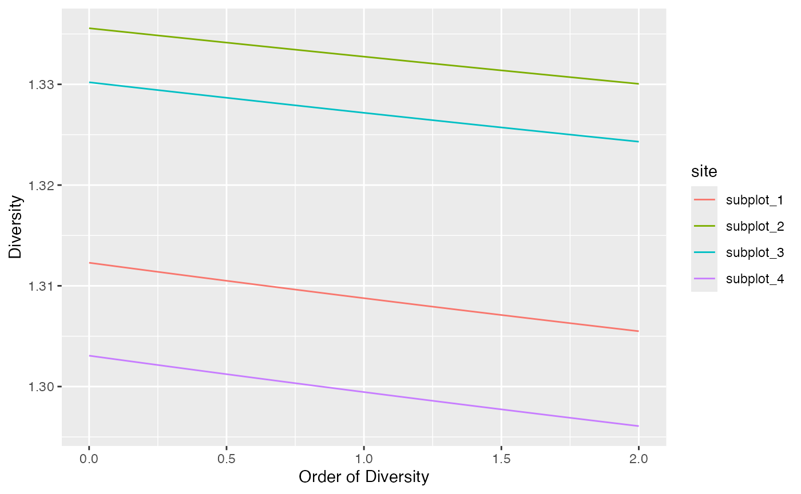

# divent

*divent* is a package for *R* designed to estimate diversity based on
HCDT entropy or similarity-based entropy. It is a reboot of the
*entropart* package, following the tidyverse manifest and easier to use.
This is a short introduction to its use.

The package allows estimating biodiversity according to the framework
based on HCDT entropy, the correction of its estimation-bias
(Grassberger 1988; Chao and Shen 2003; Chao and Jost 2015) and its
transformation into equivalent numbers of species (Hill 1973; Jost 2006;
Marcon et al. 2014). Estimation of diversity at arbitrary levels of
sampling, requiring interpolation or extrapolation (Chao et al. 2014) is
available.

Phylogenetic or functional diversity (Marcon and Hérault 2015) can be
estimated, considering phyloentropy as the average species-neutral
diversity over slices of a phylogenetic or functional tree (Pavoine and
Bonsall 2009).

Similarity-based diversity (Leinster and Cobbold 2012) can be used to
estimate (Marcon, Zhang, and Hérault 2014) functional diversity from a
similarity or dissimilarity matrix between species without requiring
building a dendrogram and thus preserving the topology of species
(Pavoine, Ollier, and Dufour 2005; Podani and Schmera 2007).

The classical diversity estimators (Shannon and Simpson entropy) can be
found in many R packages. Bias correction is rarely available except in
the *EntropyEstimation* (Cao and Grabchak 2014) package which provides
the Zhang and Grabchak’s estimators of entropy and diversity and their
asymptotic variance (not included in *divent*).

## Estimating the diversity of a community

### Community data

Community data is:

- either a numeric vector containing abundances of species (the number
  of individual of each species) or their probabilities (the proportion
  of individuals of each species, summing to 1). This format is
  convenient when a single community is considered.
- or a dataframe whose rows are communities and column are species. Its
  values are either abundances or probabilities. Special columns contain
  the site names, and their weights (e.g. their area or number of
  individuals).

Example data is provided in the dataset `paracou_6_abd`. Let’s get the
abundances of tree species in the 6.25-ha tropical forest plot \#6 from
Paracou forest station in French Guiana. It is divided into 4
equally-sized subplots:

``` r
library("divent")
```

    ## Loading required package: Rcpp

``` r
paracou_6_abd
```

    ## # A tibble: 4 × 337
    ##   site      weight Abarema_jupunba Abarema_mataybifolia Amaioua_guianensis
    ##   <chr>      <dbl>           <int>                <int>              <int>
    ## 1 subplot_1   1.56               2                    2                  1
    ## 2 subplot_2   1.56               2                    0                  1
    ## 3 subplot_3   1.56               2                    2                  0
    ## 4 subplot_4   1.56               4                    0                  0
    ## # ℹ 332 more variables: Amanoa_congesta <int>, Amanoa_guianensis <int>,
    ## #   Ambelania_acida <int>, Amphirrhox_longifolia <int>, Andira_coriacea <int>,
    ## #   Apeiba_glabra <int>, Aspidosperma_album <int>, Aspidosperma_cruentum <int>,
    ## #   Aspidosperma_excelsum <int>, Bocoa_prouacensis <int>,
    ## #   Brosimum_guianense <int>, Brosimum_rubescens <int>, Brosimum_utile <int>,
    ## #   Carapa_surinamensis <int>, Caryocar_glabrum <int>, Casearia_decandra <int>,
    ## #   Casearia_javitensis <int>, Catostemma_fragrans <int>, …

``` r
# Number of individuals in each community
abd_sum(paracou_6_abd)
```

    ## # A tibble: 4 × 3
    ##   site      weight abundance
    ##   <chr>      <dbl>     <dbl>
    ## 1 subplot_1   1.56       942
    ## 2 subplot_2   1.56       872
    ## 3 subplot_3   1.56       929
    ## 4 subplot_4   1.56       798

The data in `paracou_6_abd` is an object of class `abundances`, i.e. a
tibble with species as columns and sites as rows. It can be manipulated
as any dataframe and plotted as a rank-abundance curve:

``` r
autoplot(paracou_6_abd[1, ])
```


The `rcommunity` function allows drawing random communities, e.g. a
log-normal one (Preston 1948):

``` r
rc <- rcommunity(1, size = 10000, distribution = "lnorm")
autoplot(rc, fit_rac = TRUE, distribution = "lnorm")
```


The Whittaker plot (rank-abundance curve) of a random log-normal
distribution of 10000 individuals simulated with default parameter
(\\\sigma = 1\\) is produced.

### Diversity estimation

The classical indices of diversity are richness (the number of species),
Shannon’s and Simpson’s entropies:

``` r
div_richness(paracou_6_abd)
```

    ## # A tibble: 4 × 5
    ##   site      weight estimator   order diversity
    ##   <chr>      <dbl> <chr>       <dbl>     <dbl>
    ## 1 subplot_1   1.56 Jackknife 3     0       355
    ## 2 subplot_2   1.56 Jackknife 2     0       348
    ## 3 subplot_3   1.56 Jackknife 2     0       315
    ## 4 subplot_4   1.56 Jackknife 2     0       296

``` r
ent_shannon(paracou_6_abd)
```

    ## # A tibble: 4 × 5
    ##   site      weight estimator order entropy
    ##   <chr>      <dbl> <chr>     <dbl>   <dbl>
    ## 1 subplot_1   1.56 UnveilJ       1    4.57
    ## 2 subplot_2   1.56 UnveilJ       1    4.73
    ## 3 subplot_3   1.56 UnveilJ       1    4.65
    ## 4 subplot_4   1.56 UnveilJ       1    4.55

``` r
ent_simpson(paracou_6_abd)
```

    ## # A tibble: 4 × 5
    ##   site      weight estimator order entropy
    ##   <chr>      <dbl> <chr>     <dbl>   <dbl>
    ## 1 subplot_1   1.56 Lande         2   0.976
    ## 2 subplot_2   1.56 Lande         2   0.978
    ## 3 subplot_3   1.56 Lande         2   0.980
    ## 4 subplot_4   1.56 Lande         2   0.972

When applied to probabilities (created with `as_probaVector` in the
following example), no estimation-bias correction is applied: this means
that indices are just calculated by applying their definition function
to the probabilities (that is the naive, or plugin estimator).

``` r
library("dplyr")
```

    ## 
    ## Attaching package: 'dplyr'

    ## The following objects are masked from 'package:stats':
    ## 
    ##     filter, lag

    ## The following objects are masked from 'package:base':
    ## 
    ##     intersect, setdiff, setequal, union

``` r
paracou_6_abd %>% 
  as_probabilities() %>% 
  ent_shannon()
```

    ## # A tibble: 4 × 5
    ##   site      weight estimator order entropy
    ##   <chr>      <dbl> <chr>     <dbl>   <dbl>
    ## 1 subplot_1   1.56 naive         1    4.34
    ## 2 subplot_2   1.56 naive         1    4.48
    ## 3 subplot_3   1.56 naive         1    4.45
    ## 4 subplot_4   1.56 naive         1    4.32

When abundances are available, many estimators can be used (Marcon 2015)
to address unobserved species and the non-linearity of the indices:

``` r
ent_shannon(paracou_6_abd)
```

    ## # A tibble: 4 × 5
    ##   site      weight estimator order entropy
    ##   <chr>      <dbl> <chr>     <dbl>   <dbl>
    ## 1 subplot_1   1.56 UnveilJ       1    4.57
    ## 2 subplot_2   1.56 UnveilJ       1    4.73
    ## 3 subplot_3   1.56 UnveilJ       1    4.65
    ## 4 subplot_4   1.56 UnveilJ       1    4.55

``` r
ent_shannon(paracou_6_abd, estimator = "ChaoJost")
```

    ## # A tibble: 4 × 5
    ##   site      weight estimator order entropy
    ##   <chr>      <dbl> <chr>     <dbl>   <dbl>
    ## 1 subplot_1   1.56 ChaoJost      1    4.51
    ## 2 subplot_2   1.56 ChaoJost      1    4.68
    ## 3 subplot_3   1.56 ChaoJost      1    4.62
    ## 4 subplot_4   1.56 ChaoJost      1    4.50

The best available estimator is chosen by default: its name is returned.

Those indices are special cases of the Tsallis entropy (1988) or order
\\q\\ (respectively \\q=0,1,2\\ for richness, Shannon, Simpson):

``` r
ent_tsallis(paracou_6_abd, q = 1)
```

    ## # A tibble: 4 × 5
    ##   site      weight estimator order entropy
    ##   <chr>      <dbl> <chr>     <dbl>   <dbl>
    ## 1 subplot_1   1.56 UnveilJ       1    4.57
    ## 2 subplot_2   1.56 UnveilJ       1    4.73
    ## 3 subplot_3   1.56 UnveilJ       1    4.65
    ## 4 subplot_4   1.56 UnveilJ       1    4.55

Entropy should be converted to its effective number of species, i.e. the
number of species with equal probabilities that would yield the observed
entropy, called Hill (1973) numbers or simply diversity (Jost 2006).

``` r
div_hill(paracou_6_abd, q = 1)
```

    ## # A tibble: 4 × 5
    ##   site      weight estimator order diversity
    ##   <chr>      <dbl> <chr>     <dbl>     <dbl>
    ## 1 subplot_1   1.56 UnveilJ       1      96.3
    ## 2 subplot_2   1.56 UnveilJ       1     113. 
    ## 3 subplot_3   1.56 UnveilJ       1     105. 
    ## 4 subplot_4   1.56 UnveilJ       1      94.6

Diversity is the deformed exponential of order \\q\\ of entropy, and
entropy is the deformed logarithm of of order \\q\\ of diversity:

``` r
(d2 <- div_hill(paracou_6_abd, q = 2)$diversity)
```

    ## [1] 42.28417 44.58777 48.83999 36.01687

``` r
ln_q(d2, q = 2)
```

    ## [1] 0.9763505 0.9775723 0.9795250 0.9722352

``` r
(e2 <- ent_tsallis(paracou_6_abd, q = 2)$entropy)
```

    ## [1] 0.9763505 0.9775723 0.9795250 0.9722352

``` r
exp_q(e2, q = 2)
```

    ## [1] 42.28417 44.58777 48.83999 36.01687

If an ultrametric dendrogram describing species phylogeny (here, a mere
taxonomy with family, genus and species) is available, phylogenetic
entropy and diversity (Marcon and Hérault 2015) can be calculated:

``` r
div_phylo(paracou_6_abd, tree = paracou_6_taxo, q = 1)
```

    ## # A tibble: 4 × 4
    ##   site      weight estimator diversity
    ##   <chr>      <dbl> <chr>         <dbl>
    ## 1 subplot_1   1.56 UnveilJ        41.0
    ## 2 subplot_2   1.56 UnveilJ        52.9
    ## 3 subplot_3   1.56 UnveilJ        46.1
    ## 4 subplot_4   1.56 UnveilJ        43.2

Recall that all those functions can be applied to a numeric vector
containing abundances, without having to build an object of class
`abundances`.

``` r
# Richness of a community of 100 species, each of them with 10 individuals
div_richness(rep(10, 100))
```

    ## # A tibble: 1 × 3
    ##   estimator   order diversity
    ##   <chr>       <dbl>     <int>
    ## 1 Jackknife 0     0       100

With a Euclidian distance matrix between species, similarity-based
diversity (Leinster and Cobbold 2012; Marcon, Zhang, and Hérault 2014)
is available:

``` r
# Similarity is computed from the functional distance matrix of Paracou species
Z <- fun_similarity(paracou_6_fundist)
# Calculate diversity of order 2
div_similarity(paracou_6_abd, similarities = Z, q = 2)
```

    ## # A tibble: 4 × 5
    ##   site      weight estimator order diversity
    ##   <chr>      <dbl> <chr>     <dbl>     <dbl>
    ## 1 subplot_1   1.56 UnveilJ       2      1.31
    ## 2 subplot_2   1.56 UnveilJ       2      1.33
    ## 3 subplot_3   1.56 UnveilJ       2      1.32
    ## 4 subplot_4   1.56 UnveilJ       2      1.30

### Diversity profiles

Diversity can be plotted against its order to provide a diversity
profile. Order 0 corresponds to richness, 1 to Shannon’s and 2 to
Simpson’s diversities:

``` r
profile_hill(paracou_6_abd) %>% autoplot
```


Profiles of phylogenetic diversity and similarity-based diversity are
obtained the same way.

``` r
profile_phylo(paracou_6_abd, tree = paracou_6_taxo) %>% autoplot
```


``` r
# Similarity matrix
Z <- fun_similarity(paracou_6_fundist)
profile_similarity(paracou_6_abd, similarities = Z) %>% autoplot
```



### Diversity accumulation

Diversity can be interpolated or extrapolated to arbitrary sampling
levels.

``` r
# Estimate the diversity of 1000 individuals
div_hill(paracou_6_abd, q = 1, level = 1000)
```

    ## # A tibble: 4 × 6
    ##   site      weight estimator order level diversity
    ##   <chr>      <dbl> <chr>     <dbl> <dbl>     <dbl>
    ## 1 subplot_1   1.56 Chao2015      1  1000      78.1
    ## 2 subplot_2   1.56 Chao2015      1  1000      91.1
    ## 3 subplot_3   1.56 Chao2015      1  1000      87.2
    ## 4 subplot_4   1.56 Chao2015      1  1000      78.8

The sampling level can be a sample coverage, that is converted to the
equivalent number of individuals.

``` r
# Estimate the diversity at 80% coverage
div_hill(paracou_6_abd, q = 1, level = 0.8)
```

    ## # A tibble: 4 × 6
    ##   site      weight estimator     order level diversity
    ##   <chr>      <dbl> <chr>         <dbl> <dbl>     <dbl>
    ## 1 subplot_1   1.56 Interpolation     1   304      60.5
    ## 2 subplot_2   1.56 Interpolation     1   347      71.4
    ## 3 subplot_3   1.56 Interpolation     1   333      68.6
    ## 4 subplot_4   1.56 Interpolation     1   303      60.5

Diversity accumulation curves are available.

``` r
accum_hill(
  paracou_6_abd[1, ], 
  q = 1, 
  levels = 1:500,
  n_simulations = 100
) %>% 
  autoplot()
```


Phylogenetic diversity can be addressed the same way. Confidence
intervals of the estimation can be computed, taking into account
sampling variability.

``` r
accum_div_phylo(
  paracou_6_abd[1, ],
  tree = paracou_6_taxo,
  q = 1, 
  levels = 1:2000
) %>% 
  autoplot()
```


## Estimating the diversity of a meta-community

### Meta-community data

A metacommunity is the assemblage several communities.

The set of communities is described by the abundances of their species
and their weight.

Species probabilities in the meta-community are by definition the
weighted average of their probabilities in the communities. Abundances
are calculated so that the total abundance of the metacommunity is the
sum of all abundances of communities. If weights are equal, then the
abundances of the metacommunity are simply the sum of those of the
communities. If they are not, the abundances of the metacommunity are
generally not integer values, which complicates the estimation of
diversity.

Example:

``` r
# Abundances of three communities with four species
(abd <- matrix(
  c(
    10,  0, 25, 10, 
    20, 15, 10, 35, 
     0, 10,  5,  2
  ),
  ncol = 4
))
```

    ##      [,1] [,2] [,3] [,4]
    ## [1,]   10   10   10   10
    ## [2,]    0   20   35    5
    ## [3,]   25   15    0    2

``` r
# Community weights
w <- c(1, 2, 1)
```

A set of communities is built.

``` r
(communities <- as_abundances(abd, weights = w))
```

    ## # A tibble: 3 × 6
    ##   site   weight  sp_1  sp_2  sp_3  sp_4
    ##   <chr>   <dbl> <dbl> <dbl> <dbl> <dbl>
    ## 1 site_1      1    10    10    10    10
    ## 2 site_2      2     0    20    35     5
    ## 3 site_3      1    25    15     0     2

The function
[`metacommunity()`](https://ericmarcon.github.io/divent/reference/metacommunity.md)
creates a metacommunity. To plot it, use argument
`type = "Metacommunity` when plotting the `species_distribution`.

``` r
(mc <- metacommunity(communities))
```

    ## # A tibble: 1 × 6
    ##   site          weight  sp_1  sp_2  sp_3  sp_4
    ##   <chr>          <dbl> <dbl> <dbl> <dbl> <dbl>
    ## 1 metacommunity      4  24.6  45.7  56.2  15.5

``` r
plot(communities, type = "Metacommunity")
```


Each shade of grey represents a species. Heights correspond to the
probability of species and the width of each community is its weight.

### Diversity estimation

High level functions allow computing diversity of all communities
(\\\alpha\\ diversity), of the meta-community (\\\gamma\\ diversity),
and \\\beta\\ diversity, i.e. the number of effective communities (the
number of communities with equal weights and no common species that
would yield the observed \\\beta\\ diversity).

The `div_part` function calculates everything at once, for a given order
of diversity \\q\\:

``` r
div_part(paracou_6_abd, q = 1)
```

    ## # A tibble: 7 × 6
    ##   site          scale     estimator order diversity weight
    ##   <chr>         <chr>     <chr>     <dbl>     <dbl>  <dbl>
    ## 1 Metacommunity gamma     "UnveilJ"     1    111.     6.25
    ## 2 Metacommunity beta      ""            1      1.09  NA   
    ## 3 Metacommunity alpha     ""            1    102.    NA   
    ## 4 subplot_1     community "UnveilJ"     1     96.3    1.56
    ## 5 subplot_2     community "UnveilJ"     1    113.     1.56
    ## 6 subplot_3     community "UnveilJ"     1    105.     1.56
    ## 7 subplot_4     community "UnveilJ"     1     94.6    1.56

An alternative is the `gamma` argument of all diversity estimation
function to obtain \\\gamma\\ diversity instead of the diversity of each
community.

``` r
div_hill(paracou_6_abd, q = 1, gamma = TRUE)
```

    ## # A tibble: 1 × 4
    ##   site          estimator order diversity
    ##   <chr>         <chr>     <dbl>     <dbl>
    ## 1 Metacommunity UnveilJ       1      111.

## Full documentation

<https://ericmarcon.github.io/divent/>

## References

Cao, Lijuan, and Michael Grabchak. 2014. *EntropyEstimation: Estimation
of Entropy and Related Quantities*. R Package.

Chao, Anne, Nicholas J. Gotelli, T. C. Hsieh, Elizabeth L. Sander, K. H.
Ma, Robert K. Colwell, and Aaron M. Ellison. 2014. “Rarefaction and
Extrapolation with Hill Numbers: A Framework for Sampling and Estimation
in Species Diversity Studies.” *Ecological Monographs* 84 (1): 45–67.
<https://doi.org/10.1890/13-0133.1>.

Chao, Anne, and Lou Jost. 2015. “Estimating Diversity and Entropy
Profiles via Discovery Rates of New Species.” *Methods in Ecology and
Evolution* 6 (8): 873–82. <https://doi.org/10.1111/2041-210X.12349>.

Chao, Anne, and Tsung-Jen Shen. 2003. “Nonparametric Estimation of
Shannon’s Index of Diversity When There Are Unseen Species in Sample.”
*Environmental and Ecological Statistics* 10 (4): 429–43.
<https://doi.org/10.1023/A:1026096204727>.

Grassberger, Peter. 1988. “Finite Sample Corrections to Entropy and
Dimension Estimates.” *Physics Letters A* 128 (6-7): 369–73.
<https://doi.org/10.1016/0375-9601(88)90193-4>.

Hill, M. O. 1973. “Diversity and Evenness: A Unifying Notation and Its
Consequences.” *Ecology* 54 (2): 427–32.
<https://doi.org/10.2307/1934352>.

Jost, Lou. 2006. “Entropy and Diversity.” *Oikos* 113 (2): 363–75.
<https://doi.org/10.1111/j.2006.0030-1299.14714.x>.

Leinster, Tom, and Christina Cobbold. 2012. “Measuring Diversity: The
Importance of Species Similarity.” *Ecology* 93 (3): 477–89.
<https://doi.org/10.1890/10-2402.1>.

Marcon, Eric. 2015. “Practical Estimation of Diversity from Abundance
Data.” *HAL* 01212435 (version 2).

Marcon, Eric, and Bruno Hérault. 2015. “Decomposing Phylodiversity.”
*Methods in Ecology and Evolution* 6 (3): 333–39.
<https://doi.org/10.1111/2041-210X.12323>.

Marcon, Eric, Ivan Scotti, Bruno Hérault, Vivien Rossi, and Gabriel
Lang. 2014. “Generalization of the Partitioning of Shannon Diversity.”
*Plos One* 9 (3): e90289.
<https://doi.org/10.1371/journal.pone.0090289>.

Marcon, Eric, Zhiyi Zhang, and Bruno Hérault. 2014. “The Decomposition
of Similarity-Based Diversity and Its Bias Correction.” *HAL* 00989454
(version 3).

Pavoine, Sandrine, and Michael B. Bonsall. 2009. “Biological Diversity:
Distinct Distributions Can Lead to the Maximization of Rao’s Quadratic
Entropy.” *Theoretical Population Biology* 75 (2-3): 153–63.
<https://doi.org/10.1016/j.tpb.2009.01.008>.

Pavoine, Sandrine, Sébastien Ollier, and Anne-Béatrice Dufour. 2005. “Is
the Originality of a Species Measurable?” *Ecology Letters* 8: 579–86.
<https://doi.org/10.1111/j.1461-0248.2005.00752.x>.

Podani, János, and Dénes Schmera. 2007. “How Should a Dendrogram-Based
Measure of Functional Diversity Function? A Rejoinder to Petchey and
Gaston.” *Oikos* 116 (8): 1427–30.
<https://doi.org/10.1111/j.2007.0030-1299.16160.x>.

Preston, F. W. 1948. “The Commonness, and Rarity, of Species.” *Ecology*
29 (3): 254–83. <https://doi.org/10.2307/1930989>.

Tsallis, Constantino. 1988. “Possible Generalization of Boltzmann-Gibbs
Statistics.” *Journal of Statistical Physics* 52 (1): 479–87.
<https://doi.org/10.1007/BF01016429>.
