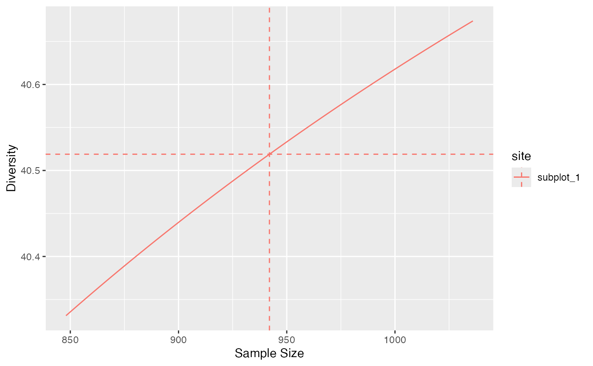
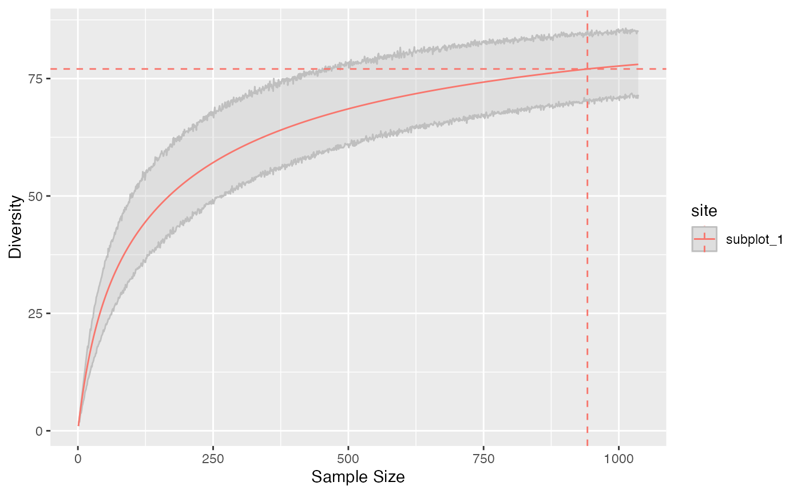
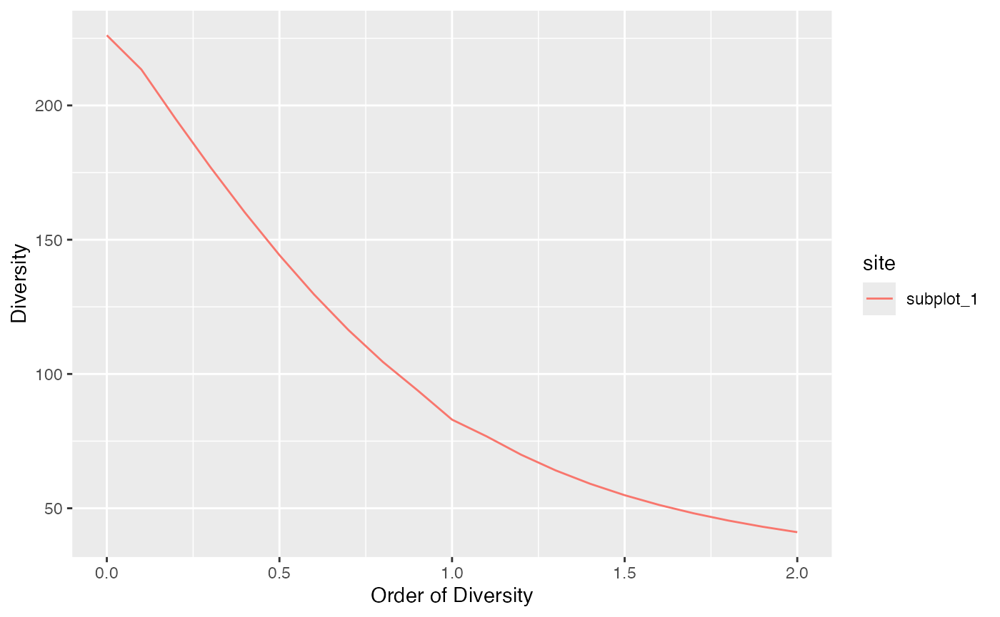

# Asymptotic Estimation, Interpolation and Extrapolation

Estimation of diversity in *divent* relies on classical assumptions that
are recalled here. The observed data is a sample of a community (or
several communities if data is a metacommunity). All “reduced-bias
estimator” are asymptotic estimators of the community diversity: if the
sample size could be extended infinitely, diversity would tend to the
diversity of the whole (asymptotic) community. In hyperdiverse
ecosystems such as evergreen forests, the asymptotic community generally
does not exist in the field because of environmental variations:
increasing the size of the sample results in sampling in different
communities. Thus, the asymptotic estimators of diversity correspond to
theoretical asymptotic communities that do not necessarily exist. In
other words, the asymptotic diversity is that of a community that would
provide the observed sample.

Diversity is accumulated as a function of sample size. HCDT (aka
Tsallis) entropy (thus Hill numbers and phylodiversity) can be estimated
at any sample size (Chao et al. 2014), by interpolation down from the
actual sample size and by extrapolation up to infinite sample size,
i.e. the asymptotic estimator. Alternatively, sample size may be
replaced by sample coverage, by interpolation from arbitrary small
sample coverages to that of the actual sample, and by extrapolation up
to the asymptotic estimator whose sample coverage is 1.

## Asymptotic estimation

If community data is a vector of probabilities, sample size is unknown
so the only available estimation is that of the actual sample.

``` r
library("dplyr")
library("divent")
# Paracou plot 6, subplot 1:
# 1,5 ha of tropical forest, distribution of probabilities
paracou_6_abd[1, ] %>% 
  as_probabilities() %>% 
  print() -> 
  prob_paracou6_1
```

    ## # A tibble: 1 × 337
    ##   site      weight Abarema_jupunba Abarema_mataybifolia Amaioua_guianensis
    ##   <chr>      <dbl>           <dbl>                <dbl>              <dbl>
    ## 1 subplot_1   1.56         0.00212              0.00212            0.00106
    ## # ℹ 332 more variables: Amanoa_congesta <dbl>, Amanoa_guianensis <dbl>,
    ## #   Ambelania_acida <dbl>, Amphirrhox_longifolia <dbl>, Andira_coriacea <dbl>,
    ## #   Apeiba_glabra <dbl>, Aspidosperma_album <dbl>, Aspidosperma_cruentum <dbl>,
    ## #   Aspidosperma_excelsum <dbl>, Bocoa_prouacensis <dbl>,
    ## #   Brosimum_guianense <dbl>, Brosimum_rubescens <dbl>, Brosimum_utile <dbl>,
    ## #   Carapa_surinamensis <dbl>, Caryocar_glabrum <dbl>, Casearia_decandra <dbl>,
    ## #   Casearia_javitensis <dbl>, Catostemma_fragrans <dbl>, …

``` r
# Diversity of order 1, no reduced-bias estimator available.
div_hill(prob_paracou6_1, q = 1)
```

    ## # A tibble: 1 × 5
    ##   site      weight estimator order diversity
    ##   <chr>      <dbl> <chr>     <dbl>     <dbl>
    ## 1 subplot_1   1.56 naive         1      77.0

Further estimation requires abundances, i.e. the number of individuals
per species. Then, the default estimator is the asymptotic one.

``` r
# Diversity of order 1, default asymptotic estimator used.
div_hill(paracou_6_abd[1, ], q = 1)
```

    ## # A tibble: 1 × 5
    ##   site      weight estimator order diversity
    ##   <chr>      <dbl> <chr>     <dbl>     <dbl>
    ## 1 subplot_1   1.56 UnveilJ       1      96.3

Several asymptotic estimators are available in the literature and
implemented in *divent*. For consistency, *divent* uses the jackknife
estimator of richness and the unveiled jackknife estimator for entropy.
The advantage of these estimators is that they provide reliable
estimations even though the sampling effort is low: then, the estimation
variance increases but its bias remains acceptable because the order of
the jackknife estimator is chosen according to the data. Poorly-sampled
communities are estimated by a higher-order jackknife, resulting in
higher estimation variance.

For well-sampled communities, i.e. in the domain of validity of the
jacknife of order 1, the Chao1 estimator of richness and the Chao-Jost
estimator of entropy are the best choices because they have the best
mathematical support, but they will severely underestimate the diversity
of poorly-sampled communities. They also are more computer-intensive.

``` r
# Estimation of richness relies on jackknife 3 (poor sampling)
div_richness(paracou_6_abd[1, ])
```

    ## # A tibble: 1 × 5
    ##   site      weight estimator   order diversity
    ##   <chr>      <dbl> <chr>       <dbl>     <dbl>
    ## 1 subplot_1   1.56 Jackknife 3     0       355

``` r
# Richness is underestimated by the Chao1 estimator
div_richness(paracou_6_abd[1, ], estimator = "Chao1")
```

    ## # A tibble: 1 × 5
    ##   site      weight estimator order diversity
    ##   <chr>      <dbl> <chr>     <dbl>     <dbl>
    ## 1 subplot_1   1.56 Chao1         0      290.

``` r
# Diversity of order 1 underestimated by the Chao-Jost estimator
div_hill(paracou_6_abd[1, ], q = 1, estimator = "ChaoJost")
```

    ## # A tibble: 1 × 5
    ##   site      weight estimator order diversity
    ##   <chr>      <dbl> <chr>     <dbl>     <dbl>
    ## 1 subplot_1   1.56 ChaoJost      1      91.3

## Choosing the estimation level

Asymptotic estimation is not always the best choice, for example when
comparing the diversity of poorly-sampled communities: a lower sample
coverage can be chosen to limit the uncertainty of estimation.

``` r
# Actual sample coverage
coverage(paracou_6_abd[1, ])
```

    ## # A tibble: 1 × 4
    ##   site      weight estimator  coverage
    ##   <chr>      <dbl> <chr>         <dbl>
    ## 1 subplot_1   1.56 ZhangHuang    0.911

The estimation level may be a sample size or a sample coverage that is
converted internally into a sample size.

``` r
# Diversity at half the sample size (interpolated)
paracou6_1_size <- abd_sum(paracou_6_abd[1, ], as_numeric = TRUE)
div_hill(paracou_6_abd[1, ], q = 1, level = round(paracou6_1_size / 2))
```

    ## # A tibble: 1 × 6
    ##   site      weight estimator     order level diversity
    ##   <chr>      <dbl> <chr>         <dbl> <dbl>     <dbl>
    ## 1 subplot_1   1.56 Interpolation     1   471      67.6

``` r
# Sample size corresponding to 90% coverage
coverage_to_size(paracou_6_abd[1, ], sample_coverage = 0.9)
```

    ## # A tibble: 1 × 4
    ##   site      weight sample_coverage  size
    ##   <chr>      <dbl>           <dbl> <dbl>
    ## 1 subplot_1   1.56             0.9   819

``` r
# Diversity at 90% sample coverage
div_hill(paracou_6_abd[1, ], q = 1, level = 0.9)
```

    ## # A tibble: 1 × 6
    ##   site      weight estimator     order level diversity
    ##   <chr>      <dbl> <chr>         <dbl> <dbl>     <dbl>
    ## 1 subplot_1   1.56 Interpolation     1   819      75.4

If the sample size is smaller than the actual sample, entropy is
interpolated.

If it is higher, entropy must be extrapolated. For diversity orders
equal to 0 (richness), 1 (Shannon) or 2 (Simpson), explicit, almost
unbiased estimators are used. Continuity of the estimation of diversity
around the actual sample size is guaranteed.

``` r
# Simpson diversity at levels from 0.9 to 1.1 times the sample size
accum_hill(
  paracou_6_abd[1, ],
  q = 2,
  levels = round(0.9 * paracou6_1_size):round(1.1 * paracou6_1_size)) %>% 
  autoplot()
```



For non-integer orders, things get more complicated. In *divent*,
asymptotic entropy is estimated by the unveiled jackknife estimator and
rarefied down to the actual sample size. There is no reason for it to
correspond exactly to the observed entropy. The asymptotic richness is
the less robust part of the estimation thus it is adjusted iteratively
until the rarefied entropy equals the actual sample’s entropy, ensuring
continuity between interpolation and extrapolation.

The default arguments of all functions apply this strategy, except for
Simpson’s diversity (\\q=2\\) that is estimated directly without bias.

## Diversity accumulation

Diversity Accumulation Curves (DAC) are a generalization of the
well-known Species Accumulation Curves (SAC). They represent diversity
as a function of sample size.

The
[`accum_hill()`](https://ericmarcon.github.io/divent/dev/reference/accum_hill.md)
function allows to build them. A bootstrap confidence interval can be
calculated around the estimated DAC by simulating random multinomial
draws of the asymptotic distribution at each sample size.

``` r
# Diversity at levels from 1 to twice the sample size
accum_hill(
  paracou_6_abd[1, ], 
  q = 1, 
  levels = seq_len(1.1 * paracou6_1_size), 
  n_simulations = 1000
) %>% 
  autoplot()
```



To ensure continuity of the DAC around the actual sample, the asymptotic
diversity is estimated by unveiling the asymptotic distribution,
choosing the number of species such that the rarefied diversity at the
observed sample size is the observed diversity. This means that the
extrapolated diversity at a high sample coverage will differ from the
best asymptotic estimation, sometimes quite much if sampling level is
poor.

``` r
# Extrapolation at 99.99% sample coverage
div_hill(paracou_6_abd[1, ], q = 1, level=0.9999)
```

    ## # A tibble: 1 × 6
    ##   site      weight estimator order level diversity
    ##   <chr>      <dbl> <chr>     <dbl> <dbl>     <dbl>
    ## 1 subplot_1   1.56 Chao2015      1  8615      94.0

``` r
# Unveiled Jaccknife asymptotic estimator
div_hill(paracou_6_abd[1, ], q = 1)
```

    ## # A tibble: 1 × 5
    ##   site      weight estimator order diversity
    ##   <chr>      <dbl> <chr>     <dbl>     <dbl>
    ## 1 subplot_1   1.56 UnveilJ       1      96.3

``` r
# Chao-Jost estimator
div_hill(paracou_6_abd[1, ], q = 1, Correction="ChaoJost")
```

    ## # A tibble: 1 × 5
    ##   site      weight estimator order diversity
    ##   <chr>      <dbl> <chr>     <dbl>     <dbl>
    ## 1 subplot_1   1.56 UnveilJ       1      96.3

## Diversity profiles at a sampling level

Diversity profiles are usually asymptotic but they can be calculated at
any coverage of sampling level.

``` r
# Diversity at levels from 1 to twice the sample size
profile_hill(paracou_6_abd[1, ], level = paracou6_1_size * 1.5) %>% 
  autoplot()
```



Extrapolated diversity is estimated at each order such that it is
continuous at the observed sample size.

## Differences with the iNEXT package

*iNEXT* (Hsieh, Ma, and Chao 2016) is designed primarily to interpolate
or extrapolate diversity of integer orders. Extrapolation of diversity
of order 0 relies on the Chao1 estimator of richness and that of order 1
uses the Chao-Jost estimator. In *divent*, extrapolation relies on the
estimation of the asymptotic distribution of the community with
asymptotic richness such that the entropy of the asymptotic distribution
rarefied to the observed sample size equals the observed entropy of the
data. This approach allows consistent estimation of extrapolated
diversity at integer and non-integer orders, thus allowing consistent
diversity profiles without discontinuities at \\q=0\\ and \\q=1\\. The
results of *iNEXT* can be obtained by forcing argument
`estimator = "ChaoJost"`.

``` r
library("iNEXT")
data(spider)
# Extrapolated diversity of an example dataset
estimateD(spider$Girdled, level=300)
```

    ##   Assemblage   m        Method Order.q        SC        qD    qD.LCL    qD.UCL
    ## 1       data 300 Extrapolation       0 0.9579518 33.317733 25.804082 40.831384
    ## 2       data 300 Extrapolation       1 0.9579518 12.869603 10.314593 15.424612
    ## 3       data 300 Extrapolation       2 0.9579518  7.983882  5.993923  9.973841

``` r
# Similar estimation by divent
div_hill(spider$Girdled, q = 0, level = 300, estimator = "ChaoJost")
```

    ## # A tibble: 1 × 4
    ##   estimator order level diversity
    ##   <chr>     <dbl> <dbl>     <dbl>
    ## 1 jackknife     0   300      33.5

``` r
div_hill(spider$Girdled, q = 1, level = 300, estimator = "ChaoJost")
```

    ## # A tibble: 1 × 4
    ##   estimator order level diversity
    ##   <chr>     <dbl> <dbl>     <dbl>
    ## 1 Chao2015      1   300      13.1

``` r
# Estimation at order 2 is explicit, with no optional choice
div_hill(spider$Girdled, q = 2, level = 300)
```

    ## # A tibble: 1 × 4
    ##   estimator order level diversity
    ##   <chr>     <dbl> <dbl>     <dbl>
    ## 1 Chao2014      2   300      7.98

``` r
# Default estimation of divent
div_hill(spider$Girdled, q = 0, level = 300)
```

    ## # A tibble: 1 × 4
    ##   estimator order level diversity
    ##   <chr>     <dbl> <dbl>     <dbl>
    ## 1 jackknife     0   300      33.5

``` r
div_hill(spider$Girdled, q = 1, level = 300)
```

    ## # A tibble: 1 × 4
    ##   estimator order level diversity
    ##   <chr>     <dbl> <dbl>     <dbl>
    ## 1 Chao2015      1   300      13.1

Small differences are due to different estimators of sample coverage:
*divent* uses the more accurate `ZhangHuang` estimator by default.

Last, confidence intervals of diversity accumulation assume normality in
*iNEXT*: estimation variance is estimated by bootstrap and the
confidence interval is defined as \\\pm 1.96\\ times the standard
deviation. In *divent*, confidence intervals are built directly from the
quantiles of bootstrapped estimations.

## References

Chao, Anne, Nicholas J. Gotelli, T. C. Hsieh, Elizabeth L. Sander, K. H.
Ma, Robert K. Colwell, and Aaron M. Ellison. 2014. “Rarefaction and
Extrapolation with Hill Numbers: A Framework for Sampling and Estimation
in Species Diversity Studies.” *Ecological Monographs* 84 (1): 45–67.
<https://doi.org/10.1890/13-0133.1>.

Hsieh, T. C., K. H. Ma, and Anne Chao. 2016. “iNEXT: An R Package for
Interpolation and Extrapolation in Measuring Species Diversity.”
*Methods in Ecology and Evolution* 7: 1451–56.
<https://doi.org/10.1111/2041-210X.12613>.
