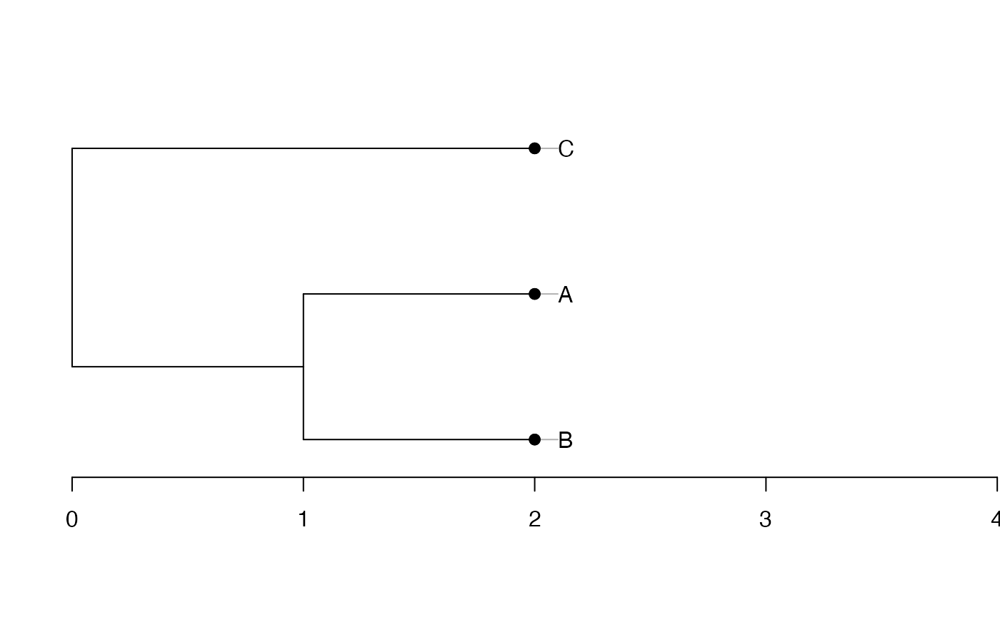

# Phylogenies in divent

*divent* is a package for *R* designed to estimate diversity based on
HCDT entropy or similarity-based entropy.

Several object classes can be used in the package to represent
phylogenies and calculate phylogenetic diversity. They are detailed
here.

## Formats used

Supported phylogenies are classes `phylo` from package *ape*, `phylog`
from package *ade4* and `hclust` from package *base*.

To optimize performance, a specific class `phylo_divent` is introduced
by the package: it is basically a list containing a `phylo` and an
`hclust` representation of the phylogeny and preprocessed useful
statistics.

The argument `tree` used in phylogenetic diversity estimation functions
of the package may be any of those formats. Conversion to `phylo_divent`
is managed internally.

## Conversion between classes

Let’s start from an ultrametric distance matrix. Three species are
defined, with distance 1 between the first 2 and distance 2 between both
and the last one.

``` r
species_dist <- matrix(c(0, 1, 2, 1, 0, 2, 2, 2, 0), nrow=3, byrow=TRUE)
row.names(species_dist) <- colnames(species_dist) <- c("A", "B", "C")
species_dist
```

    ##   A B C
    ## A 0 1 2
    ## B 1 0 2
    ## C 2 2 0

### hclust

An `hclust` object is created by UPGMA hierarchical clustering.

``` r
library("stats")
plot(
  tree.hclust <- hclust(
    as.dist(species_dist), 
    method = "average"
  ), 
  hang = -0.01, 
  axes = F
)
axis(2)
```


Node heights are stored in `$height`.

``` r
tree.hclust$height
```

    ## [1] 1 2

### phylo

Conversion to a `phylo` object is straightforward.

``` r
library("ape")
plot(tree.phylo <- as.phylo(tree.hclust))
axis(1)
```


Edge lengths have been divided by 2 during the conversion, as documented
in [`?as.phylo.hclust`](https://rdrr.io/pkg/ape/man/as.phylo.html).

``` r
tree.phylo$edge.length
```

    ## [1] 1.0 0.5 0.5 0.5

That does not suit our needs. In *divent*, edge lengths are multiplied
by 2 after conversion, so that `phylo` objects can be identical to other
phylogenies.

``` r
tree.phylo$edge.length <- 2 * tree.phylo$edge.length
plot(tree.phylo)
axis(1)
```


### phylog

The last conversion is from `phylo` to `phylog`.

``` r
library("ade4")
plot(tree.phylog <- hclust2phylog(tree.hclust))
axis(1)
```



Edge lengths are not stored directly in `phylog` objects. The `$droot`
component keeps distances from tips to root. The `$Wdist` component is a
`dist` (half a distance matrix without the zero-diagonal) whose values
are \\d\_{s,t}=\sqrt{2 \delta\_{s,t}^2}\\, where \\\delta\_{s,t}\\ is
the distance between species \\s\\ ant \\t\\.

``` r
tree.phylog$droot
```

    ##    C    A    B Int1 Root 
    ##    2    2    2    1    0

``` r
tree.phylog$Wdist^2/2
```

    ##   C A
    ## A 2  
    ## B 2 1

`phylog` trees are supported by *divent* but are converted to `hclust`:

``` r
tree2.hclust <- stats::hclust(tree.phylog$Wdist^2 / 2, "average")
plot(tree2.hclust, hang = -0.01, axes = F)
axis(2)
```


### phylo_divent

The function `as_phylo_divent` converts any object of one of the
previous types.

``` r
library("divent")
```

    ## Loading required package: Rcpp

``` r
plot(tree.phylo_divent <- as_phylo_divent(tree.phylo))
axis(2)
```


Its `plot` method is that of `dendrogram` objects.

A `phylo_divent` tree is a list.

``` r
tree.phylo_divent
```

    ## $phylo
    ## 
    ## Phylogenetic tree with 3 tips and 2 internal nodes.
    ## 
    ## Tip labels:
    ##   A, B, C
    ## 
    ## Rooted; includes branch length(s).
    ## 
    ## $hclust
    ## 
    ## Call:
    ## ape::as.hclust.phylo(x = tree)
    ## 
    ## Cluster method   : unknown 
    ## Number of objects: 3 
    ## 
    ## 
    ## $height
    ## [1] 2
    ## 
    ## $cuts
    ## [1] 1 2
    ## 
    ## $intervals
    ## [1] 1 1
    ## 
    ## $phylo_groups
    ##   0 1
    ## A 1 1
    ## B 2 1
    ## C 3 2
    ## 
    ## attr(,"class")
    ## [1] "phylo_divent"

It contains:

- `$phylo`: the tree as a `phylo` object.
- `$hclust`: the tree as a `hclust` object.
- `$height`: the height of the tree.
- `$cuts`: the heights of the nodes of the tree.
- `$intervals`: the intervals between the cuts.
- `$phylo_groups`: a matrix that describes the ancestors of species in
  each interval. The column names give the most recent cut of each
  interval. Values are the group each present species belongs to in each
  interval. In the example above, species A and B belong to the same
  group in the interval starting at 1.

## Newick dendrograms

A Newick description of a dendrogram can be read into a `phylo` object,
that can be in turn converted to `phylo_divent` or used directly in
*divent* functions.

``` r
NewickABC <- "(C:2,(A:1,B:1):1);"
plot(phyloABC <- ape::read.tree(text = NewickABC))
axis(1)
```


