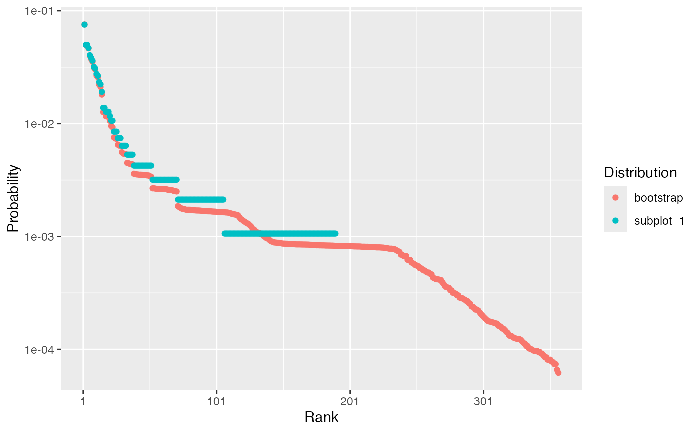

# Random communities

The package proposes several functions to simulate random communities.

## Simulating abundances according to classical models

The classical models of ecology are implemented in **divent** in the
[`rcommunity()`](https://ericmarcon.github.io/divent/dev/reference/rcommunity.md)
function.

Arguments are :

- `n`: the number of communities to draw.
- `size`: the number of individuals to draw in each community.
- `species_number`: the number of species.
- `distribution`: the distribution of species abundances.

Distributions may be “lnorm” (log-normal), “lseries” (log-series),
“geom” (geometric) or “bstick” (broken stick):

- log-normal (“lnorm”) distributions (Preston 1948) require argument
  `sd_lnorm` to set the standard deviation of the log-abundances. The
  expectation of the distribution is computed from the other arguments.
- log-series (“lseries”) distributions (Fisher, Corbet, and
  Williams 1943) rely on the `fisher_alpha` argument. They ignore
  `species_number` because the number of species is given by
  `fisher_alpha` and `size`.
- geometric (“geom”) distributions (Motomura 1932) have argument
  `prob_geom`. This distribution is not stochastic.
- MacArthur’s broken stick (“bstick,” MacArthur 1957) has no argument.

The probability distribution is first drawn, once. Abundances are then
drawn in `n` multinomial distributions, with respect to the
probabilities and `size`.

Example: a single log-normal community with 300 species and standard
deviation equal to 2 is drawn and plotted:

``` r
library("dplyr")  # for `%>%`
library("divent")
rcommunity(1, size = 1E4, species_number = 300, distribution = "lnorm") %>% 
  # Rank-abundance plot
  autoplot()
```


## Bootstrapping an observed abundance distribution

Bootstrapping allows drawing many community according to the same
probability distribution according to a multinomial law with respect to
the probabilities and `size`. This is useful to compute confidence
intervals of any statistics of the distribution.

Arguments are :

- `n`: the number of communities to draw.
- `size`: the number of individuals to draw in each community.
- `prob` or `abd`: a numeric vector containing probabilities or
  abundances. One of them must be given, the other one must be `NULL`.
- `bootstrap`: defines the technique used:
  - “Marcon2012”: following Marcon et al. (2012), abundances are just
    normalized to obtain probabilities. If `prob` is given rather than
    `abd`, these probabilities are used.
  - “Chao2013” or “Chao2015” (by default): based on the observed
    abundances (`abd` must be given), the actual probability
    distribution is estimated following Chao, Wang, and Jost (2013) or
    Chao and Jost (2015). Observed frequencies (normalized abundances)
    are not directly used as estimators of the probabilities: abundant
    species are correctly estimated but rare species are either
    overestimated or unobserved. A model based on sample coverage is
    used to correct this issue. The estimator of sample coverage is
    chosen by the argument `coverage_estimator`: the sum of observed
    probabilities equals the sample coverage. The number of unobserved
    species is estimated and their distribution (their probabilities sum
    to the coverage deficit) is arbitrary set as uniform (“Chao2013”) or
    geometric (“Chao2015”).

Example: a community based on the subplot 1 of Paracou plot 6 is drawn
and its distribution is compared to the observed frequencies.

``` r
library("ggplot2") # for `labs()`
# Draw a large community to avoid sample bias
rcommunity(1, size = 1E6, abd = as.numeric(paracou_6_abd[1, ])) %>% 
  # Compute the probabilities
  as_probabilities() %>% 
  # Rename the distribution
  mutate(site = "bootstrap") %>% 
  # Compare to the original distribution
  bind_rows(as_probabilities(paracou_6_abd[1, ])) %>% 
  autoplot() +
  labs(color = "Distribution")
```



The probabilities of abundant species are not modified. The
probabilities of rare species is smaller than their frequencies and more
than a hundred species are added.

## Simulating spatialized communities

### Communities

Spatialized communities include the location of individuals in a window.
The abundance distribution is drawn according to the same arguments as
in
[`rcommunity()`](https://ericmarcon.github.io/divent/dev/reference/rcommunity.md).

Additional arguments allow choosing:

- the window: `win` must be an `owin` object from the **spatstat.geom**
  package. Default is a square window whose side length is 1.
- the species names: `species_names` is a character vector with the
  species names. They may be generated automatically.
- the spatial distribution of the points in argument `spatial`, i.e. the
  point process used to draw their location:
  - “Binomial” draws points uniformly in the window.
  - “Thomas” draws aggregated points: `thomas_mu` is the average number
    of points per cluster and `thomas_scale` the standard deviation of
    random displacement (along each coordinate axis) of a point from its
    cluster center.
- the `weight_distribution` of the points sets their sizes:
  - “Uniform”: a uniform distribution between `w_min` and `w_max`. This
    is the default distribution, with `w_min = w_max = 1.`
  - “Weibull”: parameters are `w_min` (minimum size), `weibull_scale`
    (the scale parameter) and shape (the shape parameter).
  - “Exponential”: argument `w_mean` is the mean weight, i.e. the
    negative of the inverse of the decay rate.

Example: a random community is drawn and mapped. It contains 100 trees
of 5 species. Their spatial distribution is aggregated and their size
distribution is exponential (with default parameters).

``` r
rspcommunity(
  1, 
  size = 100, 
  species_number = 5, 
  spatial = "Thomas", 
  weight_distribution = "Exponential"
) %>% 
  autoplot()
```


### Species

To simulate communities more accurately, species can be drawn one by
one. This way, spatial structures and size distributions can be chosen
for each species.

The following example shows how to do it: a 1-ha forest made of an
aggregated species of interest and undifferentiated other ones.
[`rspcommunity()`](https://ericmarcon.github.io/divent/dev/reference/rcommunity.md)
is called with arguments `n = 1` and `species_number = 1`. A list is of
point patterns is obtained and superimposed to make a single `wmppp`
object.

``` r
library("spatstat") # for `square()`
library("dbmss")    # for `superimpose.wmppp()`
library("ggplot2")  # for `labs()`
library("dplyr")    # for `%>%`
library("divent")
# A 1-ha window
the_win <- square(100, unitname = c("meter", "meters"))
# Simulate species
the_species <- do.call(
  superimpose,
  list(
    rspcommunity(
      # A "grey" species, i.e. all individuals of species out of focus
      n = 1, species_number = 1, species_names = "others", size = 500,
      # Spatial features: binomial distribution
      win = the_win, spatial = "Binomial",
      # Size distribution
      weight_distribution = "Exponential", w_min = 10, w_mean = 15),
    rspcommunity(
      # The species of interest
      n = 1, species_number = 1, species_names = "aggregated", size = 50,
      # Spatial features: aggregated distribution
      win = the_win, spatial = "Thomas", thomas_scale = 10, thomas_mu = 20,
      # Size distribution
      weight_distribution = "Weibull", weibull_scale = 30, weibull_shape = 2,
      w_min = 10
    )
  )
)
# Map the simulated community
autoplot(the_species) +
  labs(color = "Species", size = "Diameter")
```


Post-simulation processing of such spatialized communities may be for
instance thinning to reduced the local average basal area.

``` r
# Basal area
G <- (spatstat.geom::marks(the_species)$PointWeight)^2 * pi / 4E4
sum(G)
```

    ## [1] 41.90301

``` r
# Density
G_density <- density(the_species, sigma = 10, weights = G)
plot(G_density)
```


``` r
# Thinning: the target is at most 40m² locally
target <- mean(G_density) * 40 / sum(G)
thin_im <- G_density
thin_im$v <- pmin(pmax(target / G_density$v, 0), 1)
# Plot the thinning probability
plot(thin_im)
```


``` r
# Plot the thinned community 
rthin(
  the_species,
  P = thin_im
) %>% autoplot()
```


Chao, Anne, and Lou Jost. 2015. “Estimating Diversity and Entropy
Profiles via Discovery Rates of New Species.” *Methods in Ecology and
Evolution* 6 (8): 873–82. <https://doi.org/10.1111/2041-210X.12349>.

Chao, Anne, Yi-Ting Wang, and Lou Jost. 2013. “Entropy and the Species
Accumulation Curve: A Novel Entropy Estimator via Discovery Rates of New
Species.” *Methods in Ecology and Evolution* 4 (11): 1091–1100.
<https://doi.org/10.1111/2041-210x.12108>.

Fisher, Ronald Aylmer, A. Steven Corbet, and Carrington Bonsor Williams.
1943. “The Relation Between the Number of Species and the Number of
Individuals in a Random Sample of an Animal Population.” *Journal of
Animal Ecology* 12: 42–58. <https://doi.org/10.2307/1411>.

MacArthur, Robert H. 1957. “On the Relative Abundance of Bird Species.”
*Proceedings of the National Academy of Sciences of the United States of
America* 43 (3): 293–95. <https://doi.org/10.1073/pnas.43.3.293>.

Marcon, Eric, Bruno Hérault, Christopher Baraloto, and Gabriel Lang.
2012. “The Decomposition of Shannon’s Entropy and a Confidence Interval
for *Beta* Diversity.” *Oikos* 121 (4): 516–22.
<https://doi.org/10.1111/j.1600-0706.2011.19267.x>.

Motomura, I. 1932. “On the statistical treatment of communities.”
*Zoological Magazine* 44: 379–83.

Preston, F. W. 1948. “The Commonness, and Rarity, of Species.” *Ecology*
29 (3): 254–83. <https://doi.org/10.2307/1930989>.
